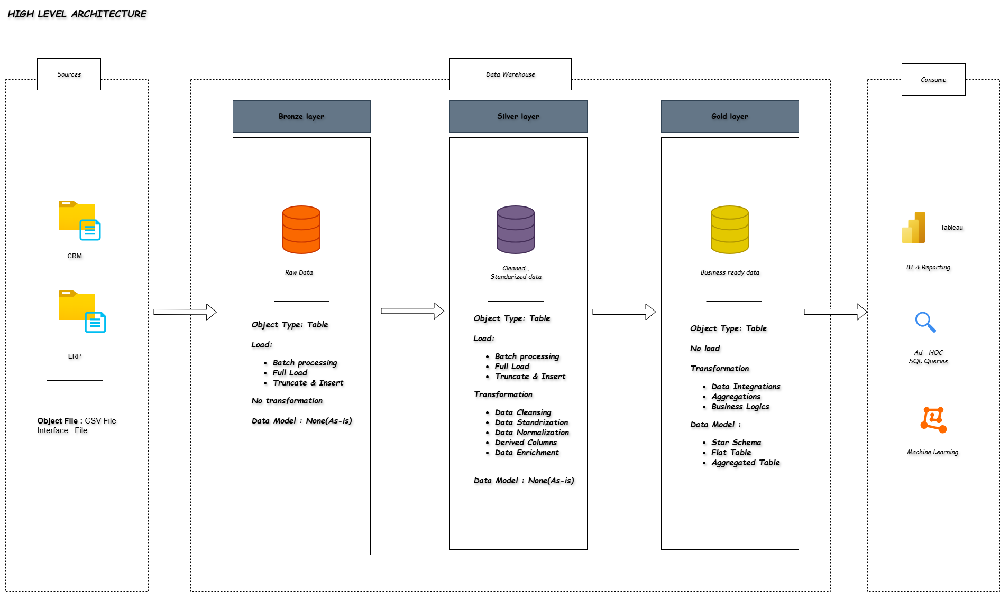

# 📊 Data Warehouse & Analytics Project

Welcome to the **Data Warehouse & Analytics Project** repository! 🚀  
This project showcases an **end-to-end data warehousing and analytics solution**, built using modern industry standards and best practices.

Designed as a **portfolio project**, it demonstrates my practical skills in **data engineering, SQL development, ETL pipelines, and analytics**, transforming raw data into meaningful business insights.

---

## 🏗️ Data Architecture – Medallion Framework

This project follows the **Medallion Architecture**, consisting of **Bronze**, **Silver**, and **Gold** layers to ensure scalability, data quality, and analytical performance.

### 🥉 Bronze Layer – Raw Data
- Stores source data in its original format
- Data ingested from **ERP and CRM CSV files**
- No transformations applied

### 🥈 Silver Layer – Clean & Standardized Data
- Data cleansing and validation
- Handling duplicates, null values, and data inconsistencies
- Standardized formats for analytics readiness

### 🥇 Gold Layer – Business-Ready Data
- Curated and aggregated data
- Modeled using a **Star Schema**
- Optimized for reporting and analytics

---

<h2 align="center">High Level Architecture</h2>

<p align="center">
  
</p>

---

## 📖 Project Overview

This project covers the complete **data lifecycle**, from ingestion to insights:

1. **Modern Data Warehouse Design**  
   - Implemented using Medallion Architecture

2. **ETL Pipeline Development**  
   - Extracting data from ERP & CRM systems  
   - Transforming and loading data across Bronze, Silver, and Gold layers

3. **Data Modeling**  
   - Fact and Dimension tables designed for analytical workloads

4. **Analytics & Reporting**  
   - SQL-based analysis for actionable business insights

🎯 This project highlights my hands-on experience in:
- SQL Development  
- Data Engineering  
- ETL Pipeline Design  
- Data Modeling (Star Schema)  
- Data Analytics & Reporting  

---

## 🚀 Project Requirements

### 🔧 Building the Data Warehouse (Data Engineering)

#### 🎯 Objective
To build a modern **SQL Server-based data warehouse** that consolidates sales data and supports analytical reporting and data-driven decision-making.

#### 📌 Specifications
- **Data Sources**:  
  - ERP and CRM systems (CSV files)
- **Data Quality**:  
  - Cleaned and validated before analysis
- **Integration**:  
  - Unified analytical data model for easy querying
- **Scope**:  
  - Latest data only (no historization)
- **Documentation**:  
  - Clear and user-friendly data model documentation

---

### 📊 BI: Analytics & Reporting (Data Analysis)

#### 🎯 Objective
Develop SQL-based analytics to deliver insights into:

- 👥 Customer Behavior  
- 📦 Product Performance  
- 📈 Sales Trends  

These insights help stakeholders make **informed business decisions**.

---

## 📂 Repository Structure

```text
data-warehouse-project/
│
├── datasets/                           # Raw ERP and CRM datasets (CSV)
│
├── docs/                               # Documentation & architecture diagrams
│   ├── etl.drawio
│   ├── data_architecture.drawio
│   ├── data_catalog.md
│   ├── data_flow.drawio
│   ├── data_models.drawio
│   ├── naming-conventions.md
│
├── scripts/                            # SQL scripts for ETL & transformations
│   ├── bronze/                         # Raw data ingestion scripts
│   ├── silver/                         # Data cleansing & transformation scripts
│   ├── gold/                           # Analytical models & views
│
├── tests/                              # Data quality & validation checks
│
├── README.md                           # Project overview
├── LICENSE                             # MIT License
├── .gitignore                          # Git ignored files
└── requirements.txt                    # Project dependencies
